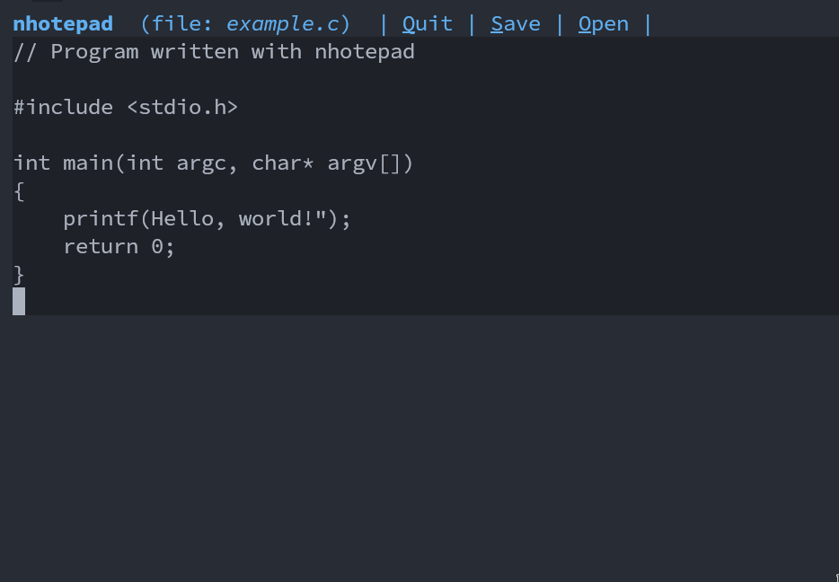

# nhotepad \[ɲowtpˈad\]

## About:

Text editor

## Usage:

### Open a file

- nhotepad file

### Options

- `C+q`: quit
- `Arrow up`: move up
- `Arrow down`: move down
- `Arrow left`: move left
- `Arrow right`: move right

### Info about development

Please, let me know any issue or but that you find!

#### Stuff that work

- Keyboard handler
- Customizable control + A - Z binds
- Write and delete characters
- Arrow movement
- Enter, tab
- Open files from command line
- Save files
- Close buffers
